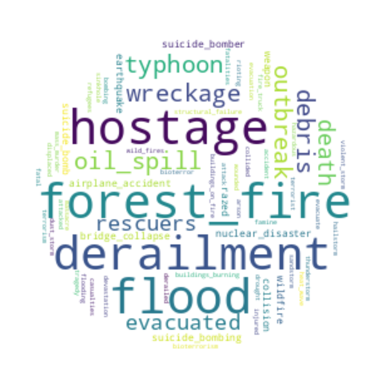
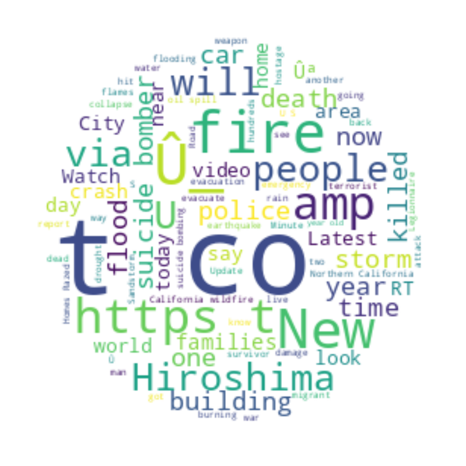
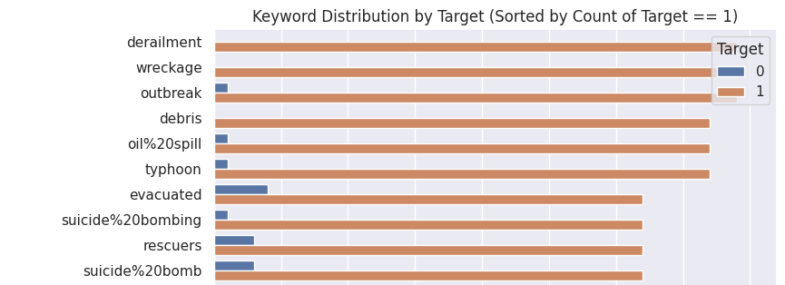
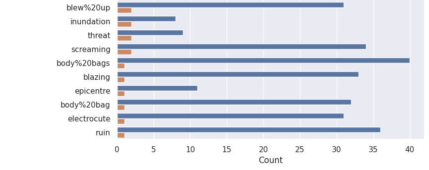
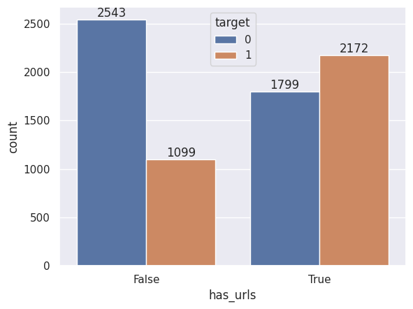
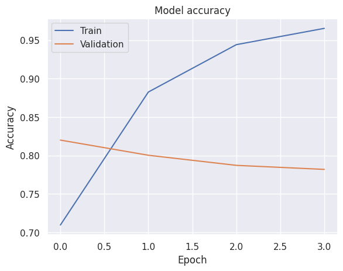
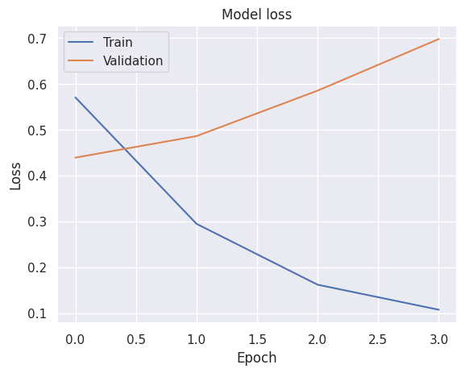
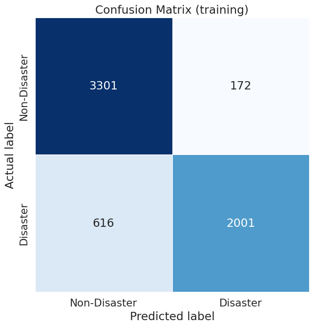
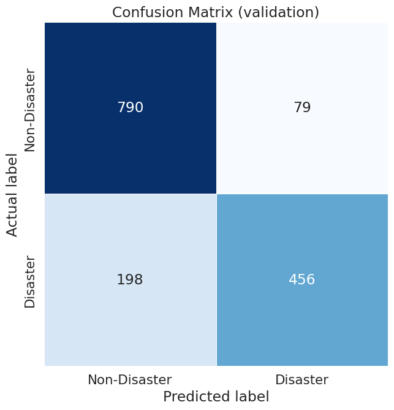

# 🧑‍💼 Tantikorn Chatavaraha - Data Science Portfolio
Welcome to my data science portfolio! Here, I showcase my projects and expertise in data science. This repository includes detailed descriptions, methodologies, and results of my work while taking the data science practicum course.

# Disaster Tweet Classification
A collaborative project focused on developing a machine learning model to classify tweets related to natural disasters. This project was undertaken as part of the Data Scientist Practicum course at Chulalongkorn University. The dataset for this project was sourced from the [Kaggle "Natural Language Processing with Disaster Tweets" competition](https://www.kaggle.com/competitions/nlp-getting-started) and included various pre-engineered features such as topic keywords and tweet locations.

## Overview
The goal of this project was to leverage machine learning and natural language processing (NLP) techniques to accurately identify disaster-related tweets. This capability can enhance emergency response efforts by providing timely information extracted from social media.

## Project Structure

### 1. Dataset Information
Before diving into the analysis, let's take a look at the dataset that forms the foundation of this project.

**Dataset Details:**
- **Number of Records:** 7,613 tweets
- **Columns:**
  - **text:** The tweet's content.
  - **keyword:** A keyword from the tweet, often related to the disaster.
  - **location:** The location associated with the tweet.
  - **target:** The classification label, where 1 indicates a disaster-related tweet and 0 indicates a non-disaster-related tweet.

**Sample Data:**
| index |                                                 text                                                |   keyword    |         location        | target |
|-------|-----------------------------------------------------------------------------------------------------|--------------|-------------------------|--------|
|   0   | Winnipeg police seek witnesses in Arlington and William fatal crash http://t.co/N2bCf4M64V          | fatal        | Winnipeg                |   1    |
|   1   | Remove the http://t.co/JAb541hHk0 and Linkury Browser Hijacker now! http://t.co/Je6Zjwh5uB          | hijacker     | Fort Collins, CO        |   1    |
|   2   | A spider has legit just run across my chest. Traumatised. For. Life.                                | traumatised  | Stage with Trey Songz   |   0    |
|   3   | ok peace I hope I fall off a cliff along with my dignity                                            | cliff%20fall | nyc                     |   1    |
|   4   | New illustration for the L.A. Times: http://t.co/qYn6KxJSTi #illustration #subway                   | derailed     | Chicago, IL             |   0    |

This dataset provides a rich source of information for developing a robust classification model. The following sections will delve into the exploratory data analysis, data cleaning, feature engineering, and modeling process.

### 2. Exploratory Data Analysis (EDA)
The EDA phase involved a comprehensive analysis of the dataset to uncover patterns and insights that would inform the feature engineering and modeling stages. Key visualizations and analyses included:

**Word Cloud Visualizations:**  

  

Word Cloud for Keywords

- **Keywords:** A word cloud was generated from the `keyword` column to identify the most common keywords associated with disaster-related tweets. This visualization highlighted terms such as "hostage", "derailment", "flood", "forest fire", and "typhoon". The size of each word in the cloud represents its frequency, with larger words indicating more common keywords in the dataset. This visualization emphasized the variety and prevalence of different disaster types discussed in the tweets, providing a visual representation of the critical themes identified during data exploration.

  

Word Cloud for Locations

- **Locations:** Another word cloud was created from the `location` column, showcasing the geographical areas most mentioned in disaster-related tweets. Locations like "USA", "New York", and "Canada" were prominently featured, indicating areas frequently impacted by the reported events.
  Key observations from the location word cloud:
  - **Prominent Locations:** The most frequently mentioned locations include "USA", "New York", "Canada", "UK", and "Nigeria" indicating high tweet activity related to disasters in these areas.
  - **Global Coverage:** The word cloud shows a wide geographic spread, including locations from various continents such as "Australia", "India", "London", and "California".
  - **Significant Cities and Countries:** Both country names (e.g., "USA", "Canada") and city names (e.g., "New York", "London") appear frequently, highlighting the urban centers often discussed in the context of disasters.
  - **Diverse Mention:** The locations range from specific cities and states to broader regions and countries, reflecting the diverse scope of the dataset in terms of geographic mentions.

  

Word Cloud for Texts

- **Text:** A word cloud was created from the `text` column to analyze the most frequently occurring words in disaster-related tweets. Interestingly, the most prominent term is "t.co," which appears frequently due to the inclusion of links in tweets. Other significant words include "fire", "people", "suicide", "flood", "police", and "killed", reflecting the critical themes discussed in the dataset. The presence of terms like "Hiroshima", "storm", and "crash" highlights specific disasters and incidents that were heavily discussed. Additionally, words like "via", "amp", and "new" show up frequently, possibly indicating common tweet structures and phrasing.

**Keyword Distribution by Target:** 

  

Keyword Distribution - Top 10

 
- **Top 10 Keywords:** The top 10 keywords predominantly associated with disaster-related tweets (Target == 1) include "derailment", "wreckage", "outbreak", "debris", and "oil spill". These terms highlight the most frequently discussed disaster events in the dataset, with a strong focus on incidents involving significant damage or threat.

  

Keyword Distribution - Least 10

- **Least 10 Keywords:** The least mentioned keywords in disaster-related tweets (Target == 1) include "blazing", "epicentre", "body bag", "electrocute", and "ruin". These terms, while still relevant to disaster contexts, appear far less frequently in the dataset, indicating they are less commonly associated with major disaster events compared to the top keywords.

**Correlation of Links and Target:**  

  

Correlation of Links and Target

- **URLs and Disaster Relevance:** The bar chart illustrates the correlation between the presence of URLs in tweets (`has_urls`) and their relevance to disaster-related content (`target`). The data shows that tweets containing URLs (True) are more likely to be classified as relevant to disasters (Target == 1) compared to those without URLs (False). Specifically, there are 2,172 disaster-related tweets with URLs compared to 1,799 non-disaster-related tweets. In contrast, tweets without URLs are predominantly non-disaster-related, with 2,543 such tweets compared to 1,099 disaster-related tweets. This suggests that disaster-related tweets often include URLs, possibly linking to news articles, videos, or other resources related to the event being discussed.

These insights were instrumental in guiding the feature engineering process and refining the overall model strategy. By thoroughly understanding the data's distribution, language patterns, and contextual differences, the team was able to make informed decisions that significantly enhanced the model's predictive capabilities.

### 3. Data Cleaning & Feature Engineering
After conducting the Exploratory Data Analysis, the next step involved cleaning the data and engineering new features to enhance model performance.

**Data Cleaning:**
- **Text Cleaning:** The text data underwent a cleaning process that involved removing non-text elements, converting it to lowercase, and performing tokenization. Stop words were removed, and lemmatization was applied to standardize the text for analysis.
- **Keyword Cleaning:** The keyword column was cleaned by standardizing and correcting the keywords associated with each tweet. Similar keywords were grouped together, and missing keywords were predicted using a Recurrent Neural Network (RNN) trained on the existing data, ensuring uniformity across the dataset.
- **Location Cleaning:** The location column was removed because of the diversity in the data.

**Keyword Cleaning Table:**  
This table provides an example of keywords that were predicted by the RNN and their associated cleaned text and target values.
| index | cleaned_text                                                                           | predicted_keyword    | target |
|-------|----------------------------------------------------------------------------------------|----------------------|--------|
| 0     | deeds reason earthquake may allah forgive us                                           | earthquake           | 1      |
| 1     | forest fire near la ronge sask canada                                                  | forest_fire          | 1      |
| 2     | residents ask place notify officer evacuation shelter place order expect               | evacuate             | 1      |
| 3     | people receive wildfires evacuation order california                                   | evacuate             | 1      |
| 4     | get send photo ruby alaska smoke wildfires pour school                                 | smoke                | 1      |
| 5     | rockyfire update california hwy close directions due lake county fire cafire wildfires | evacuate             | 1      |
| 6     | flood disaster heavy rain cause flash flood streets manitou colorado spring areas      | flood                | 1      |
| 7     | top hill see fire woods                                                                | fire                 | 1      |
| 8     | emergency evacuation happen build across street                                        | buildings_burning    | 1      |
| 9     | afraid tornado come area                                                               | tornado              | 1      |

**Feature Engineering:**
- **cleaned_text:** This feature represents the cleaned version of the tweet text, with non-alphabet characters removed, text converted to lowercase, and stopwords removed. This ensures that the core content of each tweet is captured for analysis.
- **cleaned_keyword:** The keyword column was processed to standardize the keywords and fill in missing values. The cleaned keywords provide a consistent set of terms for modeling.
- **has_urls:** This binary feature indicates the presence of URLs in the tweets, providing a simple yet effective way to capture the presence of links, which were found to be correlated with disaster-related content.

### 4. Model Training and Evaluation
After finalizing the data preparation, the next step was to design and train a model capable of processing the text, keywords, and URLs associated with each tweet. Given the nature of the problem, a deep learning model was employed, leveraging the power of Recurrent Neural Networks (RNN) for handling sequential data.

- **Model Architecture:**
  - **Text Input:** The model starts with a text input layer, where the textual data is passed through an Embedding layer. This layer converts the text data into dense vectors of size 128. These vectors are then fed into an LSTM layer with 64 units, which captures the sequential patterns within the text. To prevent overfitting, a Dropout layer with a rate of 0.6 is applied after the LSTM.
  - **Keyword Input:** The keywords associated with each tweet are processed through a separate input layer. No additional layers were applied to this input, as the keywords were already processed and encoded.
  - **URL Input:** The presence of URLs in the tweet is represented by a binary input layer.
  - **Combined Input:** The outputs from the LSTM, keyword input, and URL input layers are concatenated into a single vector, which represents the combined features of the tweet.
  - **Dense Layer:** The concatenated vector is passed through a Dense layer with 64 units and a tanh activation function, which introduces non-linearity into the model.
  - **Output Layer:** Finally, the output layer consists of a single neuron with a sigmoid activation function, producing the probability of the tweet belonging to the target class.

- **Model Compilation and Training:**
  - **Loss Function:** The model was compiled using the binary cross-entropy loss function, which is suitable for binary classification tasks.
  - **Optimizer:** The Adam optimizer was selected for its efficiency in training deep learning models.
  - **Early Stopping:** To prevent overfitting and ensure the best model is retained, Early Stopping was implemented, monitoring the validation loss. If the validation loss did not improve for three consecutive epochs by a minimum of 0.01, training was halted, and the model with the best performance was restored.
  - **Model Checkpointing:** Additionally, the ModelCheckpoint callback was used to save the model weights corresponding to the best validation loss during training.

The model was trained over 100 epochs with a batch size of 128, using the training and validation datasets. The training process was enhanced by the use of Early Stopping and Model Checkpointing, which ensured that the model generalizes well to unseen data.
 

  
  &nbsp;&nbsp;&nbsp;&nbsp;
  

Model Accuracy and Loss

### 5. Model Evaluation & Results
The model's performance was assessed on both the training and validation datasets to understand its effectiveness in predicting disaster-related tweets.

**Results:**
| Evaluation Metrics | Training Set | Validation Set |
| ------------------ | ------------ | -------------- |
| Accuracy (%)       | 88           | 82             |
| F1-Score (%)       | 84           | 77             |
| Precision (%)      | 92           | 84             |
| Recall (%)         | 78           | 70             |

  
  &nbsp;&nbsp;&nbsp;&nbsp;
  

Confusion Matrices of Training and Validation Dataset

**Analysis:**
- **Overall Performance:** The model demonstrates solid performance with an accuracy of 82% on the validation set, which suggests it generalizes well to unseen data. However, there is a noticeable drop from the training set's performance, indicating some overfitting.
- **Disaster-Related Prediction:** The F1-Score of 77% on the validation set shows a good balance between precision and recall, but there’s room for improvement, particularly in reducing false negatives, which is critical in disaster contexts. The relatively lower recall on the validation set suggests that the model misses some disaster-related tweets, which could be fatal in real-world scenarios.

### 6. Conclusion

**Summary of Findings:**
- The project demonstrated that machine learning models, when combined with effective feature engineering and evaluation techniques, can accurately classify disaster-related tweets. The insights gained from this classification can significantly aid in disaster response efforts.

**Impact:**
- This model has the potential to make a significant impact on disaster management by providing timely, relevant information to authorities and the public, ultimately contributing to more effective and efficient disaster response and mitigation efforts.

## Acknowledgements

This project was part of the Data Scientist Practicum course at Chulalongkorn University. Special thanks to our instructors and peers for their guidance and support throughout the project.
