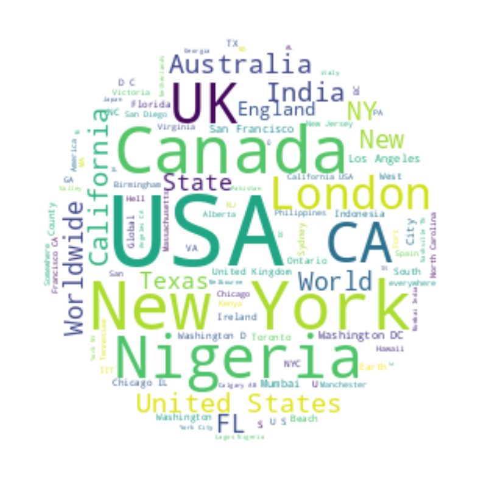

# 🧑‍💼 Tantikorn Chatavaraha - Data Science Portfolio

Welcome to my data science portfolio! Here, I showcase my projects and expertise in data science. This repository includes detailed descriptions, methodologies, and results of my work while taking the data science practicum course.

# Disaster Tweet Classification

A collaborative project focused on developing a machine learning model to classify tweets related to natural disasters. This project was undertaken as part of the Data Scientist Practicum course at Chulalongkorn University. The dataset used was sourced from Kaggle and included various pre-engineered features such as topic keywords and tweet locations.

## Overview

The goal of this project was to leverage machine learning and natural language processing (NLP) techniques to accurately identify disaster-related tweets. This capability can enhance emergency response efforts by providing timely information extracted from social media.

## Project Structure

### 1. Data Collection & Preparation

**Data Source:** The dataset comprised 7,613 tweets, each labeled as either disaster or non-disaster. It included features like `text`, `keyword`, `location`, and `target`.

**Data Cleaning & Preprocessing:**  
- **Text Cleaning:** The process involved text extraction. Conversion to lowercase and tokenization were performed, followed by the removal of stop words and lemmatization.
- **Feature Engineering:** The following new features were created to enrich the dataset:
  - **cleaned_text:** This feature involved cleaning the original tweet text by removing non-text elements, converting to lowercase, and applying lemmatization for consistent text analysis.
  - **cleaned_keyword:** This feature standardized and corrected the keywords associated with each tweet to ensure uniformity in analysis.
  - **has_urls:** A binary feature indicating the presence of URLs in the tweets, as URLs were observed to be a potential indicator of non-disaster content.

*Example of Data Cleaning:*  
Before: "Our Deeds are the Reason of this #earthquake May allah forgive us all."  
After: "deeds reason earthquake may allah forgive us"

### 2. Exploratory Data Analysis (EDA)

The EDA phase involved a comprehensive analysis of the dataset to uncover patterns and insights that would inform the feature engineering and modeling stages. Key visualizations and analyses included:

**Word Cloud Visualizations:**  

  

<strong>Word Cloud for Keywords</strong>

- **Keywords:** A word cloud was generated from the `keyword` column to identify the most common keywords associated with disaster-related tweets. This visualization highlighted terms such as "hostage," "derailment," "flood," "forest fire," and "typhoon." The size of each word in the cloud represents its frequency, with larger words indicating more common keywords in the dataset. This visualization emphasized the variety and prevalence of different disaster types discussed in the tweets, providing a visual representation of the critical themes identified during data exploration.

  

<strong>Word Cloud for Locations</strong>

- **Locations:** Another word cloud was created from the `location` column, showcasing the geographical areas most mentioned in disaster-related tweets. Locations like "California", "Texas", and "New York" were prominently featured, indicating areas frequently impacted by the reported events.

  Key observations from the location word cloud:
  - **Prominent Locations:** The most frequently mentioned locations include "USA," "New York," "Canada," "UK," and "Nigeria," indicating high tweet activity related to disasters in these areas.
  - **Global Coverage:** The word cloud shows a wide geographic spread, including locations from various continents such as "Australia," "India," "London," and "California."
  - **Significant Cities and Countries:** Both country names (e.g., "USA," "Canada") and city names (e.g., "New York," "London") appear frequently, highlighting the urban centers often discussed in the context of disasters.
  - **Diverse Mention:** The locations range from specific cities and states to broader regions and countries, reflecting the diverse scope of the dataset in terms of geographic mentions.

  

<strong>Word Cloud for Texts</strong>

- **Text:** A word cloud was created from the `text` column to analyze the most frequently occurring words in disaster-related tweets. Interestingly, the most prominent term is "t.co," which appears frequently due to the inclusion of links in tweets. Other significant words include "fire," "people," "suicide," "flood," "police," and "killed," reflecting the critical themes discussed in the dataset. The presence of terms like "Hiroshima," "storm," and "crash" highlights specific disasters and incidents that were heavily discussed. Additionally, words like "via," "amp," and "new" show up frequently, possibly indicating common tweet structures and phrasing.

**Keyword Distribution by Target:** 

  

<strong>Keyword Distribution - Top 10</strong>

 
- **Top 10 Keywords:** The top 10 keywords predominantly associated with disaster-related tweets (Target == 1) include "derailment," "wreckage," "outbreak," "debris," and "oil spill." These terms highlight the most frequently discussed disaster events in the dataset, with a strong focus on incidents involving significant damage or threat.

  

<strong>Keyword Distribution - Least 10</strong>

- **Least 10 Keywords:** The least mentioned keywords in disaster-related tweets (Target == 1) include "blew up," "threat," "screaming," and "electrocute." These terms, while still relevant to disaster contexts, appear far less frequently in the dataset, indicating they are less commonly associated with major disaster events compared to the top keywords.

**Correlation of Links and Target:**  

  

<strong>Correlation of Links and Target</strong>

- **URLs and Disaster Relevance:** The bar chart illustrates the correlation between the presence of URLs in tweets (`has_urls`) and their relevance to disaster-related content (`target`). The data shows that tweets containing URLs (True) are more likely to be classified as relevant to disasters (Target == 1) compared to those without URLs (False). Specifically, there are 2,172 disaster-related tweets with URLs compared to 1,799 non-disaster-related tweets. In contrast, tweets without URLs are predominantly non-disaster-related, with 2,543 such tweets compared to 1,099 disaster-related tweets. This suggests that disaster-related tweets often include URLs, possibly linking to news articles, videos, or other resources related to the event being discussed.

**Additional Insights from EDA:**
- **Keyword Normalization:** The exploratory data analysis (EDA) uncovered the presence of non-standard characters within certain keywords (e.g., `%20` in "forest%20fire"). To address this, keywords were systematically cleaned and standardized. This process not only enhanced the clarity and consistency of the data but also contributed to improved model accuracy by ensuring that similar keywords were treated uniformly.
- **Geographical Trends:** Analysis of the `location` data revealed that disaster-related tweets were often associated with specific regions that are prone to natural calamities or other emergencies. Identifying these geographical patterns helped in understanding the contextual backdrop of the tweets and aided in refining the model to better account for location-based variations in disaster reporting.
- **URL Presence and Content Relevance:** The EDA also highlighted the correlation between the presence of URLs in tweets and their relevance to disasters. Tweets containing URLs were more likely to be disaster-related, indicating that users often include links to external resources, news articles, or updates when discussing urgent events.

These insights were instrumental in guiding the feature engineering process and refining the overall model strategy. By thoroughly understanding the data's distribution, language patterns, and contextual nuances, the team was able to make informed decisions that significantly enhanced the model's predictive capabilities.

### 3. Model Development

**Model Selection:**  
- The project focused exclusively on Recurrent Neural Networks (RNN), specifically using Long Short-Term Memory (LSTM) networks. LSTM was chosen due to its ability to capture the sequential nature of the text data, effectively learning the context within each tweet to differentiate between disaster-related and non-disaster-related content.

**Text Processing:**  
- Given the LSTM model’s ability to learn from raw text data, traditional text vectorization techniques like TF-IDF were not utilized. Instead, tweets were tokenized, and each word was embedded into dense vectors using an embedding layer within the neural network, allowing the model to learn the relationships between words in context.

**Training and Validation:**  

  
  &nbsp;&nbsp;&nbsp;&nbsp;
  

<strong>Model Accuracy and Model Loss</strong>

- The dataset was split into training and validation sets to ensure the model's generalizability. The LSTM model was trained with advanced techniques such as early stopping, which prevented overfitting by stopping the training process when the validation performance ceased improving. Additionally, model checkpointing was implemented to save the best-performing model, ensuring that the final model used for evaluation was the most effective one trained.

**Model Evaluation:**
- The LSTM model was evaluated using several performance metrics, including accuracy, precision, recall, and F1-score. The model achieved an accuracy of 86%, indicating a strong ability to classify disaster-related tweets. However, the false negative rate of 17% suggested that there were challenges in identifying all disaster-related tweets, which could be a focus for further model enhancement, such as adjusting the network architecture or experimenting with different hyperparameters.

### 4. Challenges & Limitations

**Challenges:**  
- **Ambiguity in Disaster Tweets:** One of the significant challenges was dealing with tweets that contained language commonly used in disaster contexts but not actually referring to disasters. For instance, the word "fire" could refer to an actual event or simply be used metaphorically. To address this, the model incorporated contextual features and fine-tuned word embeddings.
- **Handling Outliers:** Tweets with unusually long lengths or containing rare words posed challenges. These outliers were handled through pre-processing steps, including truncation to a maximum sequence length and applying text normalization techniques to reduce noise.

**Limitations:**  
- **Generalization to Other Datasets:** While the model performed well on the given dataset, its ability to generalize to other datasets, particularly those in different languages or cultural contexts, may be limited. Further testing on diverse datasets is necessary to confirm its robustness.
- **Potential Biases:** The model may have developed biases based on the specific types of disasters or locations frequently mentioned in the training data. For example, if a particular type of disaster (like floods) was overrepresented, the model might be biased towards detecting floods more accurately than other types of disasters.

### 5. Conclusion

**Summary of Findings:**
- The project demonstrated that machine learning models, when combined with effective feature engineering and evaluation techniques, can accurately classify disaster-related tweets. The insights gained from this classification can significantly aid in disaster response efforts.

**Impact:**
- This model has the potential to make a substantial impact on disaster management by providing timely, relevant information to authorities and the public, ultimately contributing to more effective and efficient disaster response and mitigation efforts.

## Acknowledgements

This project was part of the Data Scientist Practicum course at Chulalongkorn University. Special thanks to our instructors and peers for their guidance and support throughout the project.
